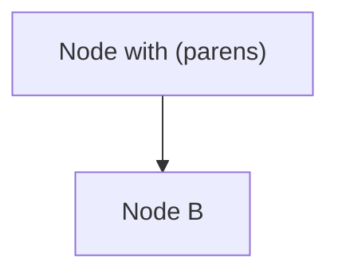

# Notion-flavored Markdown Reference

Notion-flavored Markdown (NFM) is a variant of standard Markdown with additional features to support all Block and Rich text types.

## Core syntax rules

- Use **tabs** for indentation
- Use **backslashes** to escape: `\ * ~ \` $ [ ] < > { } | ^ `
- Empty lines are stripped — use `<empty-block/>` alone on its own line for an explicit empty line
- Do NOT escape characters inside code blocks

---

## Block types

### Text / Paragraph
```
Rich text {color="Color"}
	Children
```

### Headings
```
# H1 {color="Color"}
## H2 {color="Color"}
### H3 {color="Color"}
#### H4 {color="Color"}
```
H5 and H6 are converted to H4.

### Bulleted list
```
- Rich text {color="Color"}
	Children
```
Always include inline rich text — empty list items look bad.

### Numbered list
```
1. Rich text {color="Color"}
	Children
```

### Empty line
```
<empty-block/>
```
Must be on its own line with no other text.

---

## Rich text types

| Format | Syntax |
|---|---|
| Bold | `**text**` |
| Italic | `*text*` |
| Strikethrough | `~~text~~` |
| Underline | `<span underline="true">text</span>` |
| Inline code | `` `code` `` |
| Link | `[text](URL)` |
| Citation | `[^URL]` |
| Inline math | `$Equation$` (whitespace before `$` and after `$`, none inside) |
| Color | `<span color="Color">text</span>` |
| Line break (in-block) | `<br>` |

---

## Colors

**Text colors:** gray, brown, orange, yellow, green, blue, purple, pink, red

**Background colors:** gray_bg, brown_bg, orange_bg, yellow_bg, green_bg, blue_bg, purple_bg, pink_bg, red_bg

**Usage:**
- Block: `{color="Color"}` on first line of block
- Inline: `<span color="Color">text</span>`

---

## Advanced blocks (page content only)

### Quote
```
> Rich text {color="Color"}
	Children
```
Multi-line: `> Line 1<br>Line 2<br>Line 3`
Multiple `>` lines = multiple separate quotes (not one block).

### To-do
```
- [ ] Rich text {color="Color"}
- [x] Rich text {color="Color"}
```

### Toggle
```
<details color="Color">
<summary>Rich text</summary>
	Children (must be indented)
</details>
```

Toggle heading:
```
## Rich text {toggle="true" color="Color"}
	Children (must be indented)
```

### Divider
```
---
```

### Callout
```
::: callout {icon="emoji" color="Color"}
Rich text
Children
:::
```
Use NFM inside callouts (not HTML). Supports multiple blocks.

### Columns
```
<columns>
<column>
Children
</column>
<column>
Children
</column>
</columns>
```

### Table
```
<table fit-page-width="true" header-row="true" header-column="false">
<colgroup>
<col color="Color">
<col>
</colgroup>
<tr color="Color">
<td>Header 1</td>
<td color="Color">Header 2</td>
</tr>
<tr>
<td>Data</td>
<td>Data</td>
</tr>
</table>
```
- All attributes optional, default false
- Cells: rich text only (no headings/lists/images)
- Use `**bold**` inside cells, not `<strong>`
- Color precedence: cell > row > column

### Code block
````
```language
Code (write literally, do not escape)
```
````

### Mermaid diagram
````

````
- Wrap labels with special chars in double quotes
- Use `<br>` for line breaks inside labels, not `\n`
- Never use `\(` or `\)` — wrap in quotes instead

### Equation block
```
$ Equation $
```

### Image
```
 {color="Color"}
```

### Video / Audio / File / PDF
```
<video src="URL" color="Color">Caption</video>
<audio src="URL" color="Color">Caption</audio>
<file src="URL" color="Color">Caption</file>
<pdf src="URL" color="Color">Caption</pdf>
```
Use full URLs or compressed URLs (`{{URL}}`). Do NOT wrap full URLs in `{{}}`.

### Table of contents
```
<table_of_contents color="Color"/>
```

### Synced block (new)
```
<synced_block>
	Children
</synced_block>
```
Omit `url` when creating new. URL is auto-generated.

### Synced block reference
```
<synced_block_reference url="{{URL}}">
	Children
</synced_block_reference>
```

### Page (moves existing page)
```
<page url="{{URL}}" color="Color">Title</page>
```
⚠️ Using with an existing URL **moves** that page. Use `<mention-page>` to just reference.

### Database
```
<database url="{{URL}}" inline="true" icon="emoji" color="Color" data-source-url="{{URL}}">Title</database>
```
- `url`: moves existing database here
- `data-source-url`: creates linked view
- Use `<mention-database>` to just reference

### Meeting notes
```
<meeting-notes>
Rich text (title)
<summary>
	AI summary
</summary>
<notes>
	User notes
</notes>
</meeting-notes>
```
- Omit `<summary>` and `<transcript>` when creating new
- `<transcript>` cannot be edited by AI
- All content inside must be indented deeper than `<meeting-notes>`

---

## Mentions

```
<mention-user url="{{URL}}">Name</mention-user>
<mention-page url="{{URL}}">Page title</mention-page>
<mention-database url="{{URL}}">DB name</mention-database>
<mention-data-source url="{{URL}}">Name</mention-data-source>
<mention-agent url="{{URL}}">Name</mention-agent>
<mention-date start="YYYY-MM-DD" end="YYYY-MM-DD"/>
<mention-date start="YYYY-MM-DD" startTime="HH:mm" timeZone="IANA_TIMEZONE"/>
```
URL must refer to an existing object. Inner text is optional (UI always resolves the name).

---

## Custom emoji
```
:emoji_name:
```
